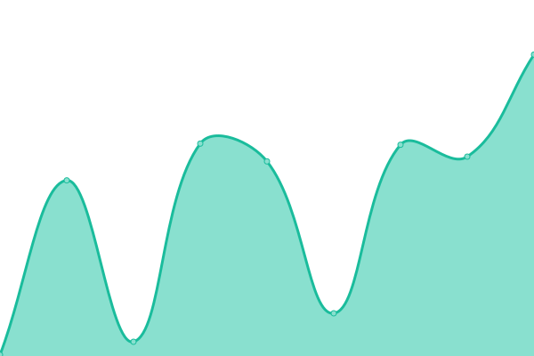

# [📈 Live Status](https://status.jackz.me): <!--live status--> **🟧 Partial outage**

This repository contains the open-source uptime monitor powered by [Upptime](https://github.com/upptime/upptime).

<!--start: status pages-->
<!-- This summary is generated by Upptime (https://github.com/upptime/upptime) -->
<!-- Do not edit this manually, your changes will be overwritten -->
<!-- prettier-ignore -->
| URL | Status | History | Response Time | Uptime |
| --- | ------ | ------- | ------------- | ------ |
|  [US Central - NE (HS1B)](http://hs1b.servers.jackz.me) | 🟥 Down | [us-central-ne-hs-1-b.yml](https://github.com/Jackzmc/upptime/commits/HEAD/history/us-central-ne-hs-1-b.yml) | 

 187ms
     
 | 

<a href="https://status.jackz.me/history/us-central-ne-hs-1-b">14.13%</a>
    

|  [US East - (ORACLE1)](http://oracle1.servers.jackz.me) | 🟩 Up | [us-east-oracle-1.yml](https://github.com/Jackzmc/upptime/commits/HEAD/history/us-east-oracle-1.yml) | 

 96ms
     
 | 

<a href="https://status.jackz.me/history/us-east-oracle-1">100.00%</a>
    

|  [US East - (OVH1)](http://ovh1.servers.jackz.me) | 🟩 Up | [us-east-ovh-1.yml](https://github.com/Jackzmc/upptime/commits/HEAD/history/us-east-ovh-1.yml) | 

 105ms
     
 | 

<a href="https://status.jackz.me/history/us-east-ovh-1">100.00%</a>
    

<!--end: status pages-->

[**Visit our status website →**](https://status.jackz.me)
