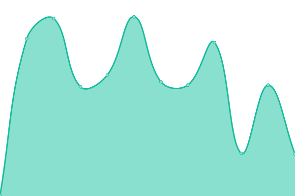

# [📈 Live Status](https://status.jackz.me): <!--live status--> **🟩 All systems operational**

This repository contains the open-source uptime monitor powered by [Upptime](https://github.com/upptime/upptime).

<!--start: status pages-->
<!-- This summary is generated by Upptime (https://github.com/upptime/upptime) -->
<!-- Do not edit this manually, your changes will be overwritten -->
<!-- prettier-ignore -->
| URL | Status | History | Response Time | Uptime |
| --- | ------ | ------- | ------------- | ------ |
|  [US Central - NE (HS1B)](http://hs1b.servers.jackz.me) | 🟩 Up | [us-central-ne-hs-1-b.yml](https://github.com/Jackzmc/upptime/commits/HEAD/history/us-central-ne-hs-1-b.yml) | 

 262ms
     
 | 

<a href="https://status.jackz.me/history/us-central-ne-hs-1-b">100.00%</a>
    

|  [US Central - TX (NFO) [depr.]](http://c.us-central.servers.jackz.me) | 🟩 Up | [us-central-tx-nfo-depr.yml](https://github.com/Jackzmc/upptime/commits/HEAD/history/us-central-tx-nfo-depr.yml) | 

 209ms
     
 | 

<a href="https://status.jackz.me/history/us-central-tx-nfo-depr">100.00%</a>
    

|  [US Central - MO (NOCIX1)](http://nocix1a.servers.jackz.me) | 🟩 Up | [us-central-mo-nocix-1.yml](https://github.com/Jackzmc/upptime/commits/HEAD/history/us-central-mo-nocix-1.yml) | 

 187ms
     
 | 

<a href="https://status.jackz.me/history/us-central-mo-nocix-1">100.00%</a>
    

|  [US - East (ORACLE1)](https://oracle1.jackz.me) | 🟩 Up | [us-east-oracle-1.yml](https://github.com/Jackzmc/upptime/commits/HEAD/history/us-east-oracle-1.yml) | 

 237ms
     
 | 

<a href="https://status.jackz.me/history/us-east-oracle-1">98.34%</a>
    

<!--end: status pages-->

[**Visit our status website →**](https://status.jackz.me)
