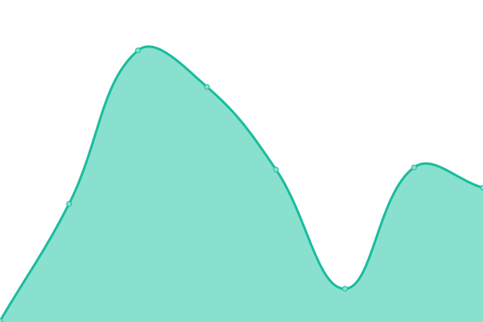

# [📈 Live Status](https://status.jackz.me): <!--live status--> **🟩 All systems operational**

This repository contains the open-source uptime monitor and status page for [Upptime](https://upptime.js.org), powered by [Upptime](https://github.com/upptime/upptime).

With [Upptime](https://upptime.js.org), you can get your own unlimited and free uptime monitor and status page, powered entirely by a GitHub repository. We use [Issues](https://github.com/upptime/upptime/issues) as incident reports, [Actions](https://github.com/jackzmc/upptime/actions) as uptime monitors, and [Pages](https://status.jackz.me) for the status page.

<!--start: status pages-->
<!-- This summary is generated by Upptime (https://github.com/upptime/upptime) -->
<!-- Do not edit this manually, your changes will be overwritten -->
<!-- prettier-ignore -->
| URL | Status | History | Response Time | Uptime |
| --- | ------ | ------- | ------------- | ------ |
|  [US Central A (HS)](http://a.us-central.servers.jackz.me) | 🟩 Up | [us-central-a-hs.yml](https://github.com/Jackzmc/upptime/commits/HEAD/history/us-central-a-hs.yml) | 

 1640ms
     
 | 

<a href="https://status.jackz.me/history/us-central-a-hs">100.00%</a>
    

|  [US Central C](http://c.us-central.servers.jackz.me) | 🟩 Up | [us-central-c.yml](https://github.com/Jackzmc/upptime/commits/HEAD/history/us-central-c.yml) | 

 177ms
     
 | 

<a href="https://status.jackz.me/history/us-central-c">97.18%</a>
    

|  [US East A](http://a.us-east.servers.jackz.me) | 🟩 Up | [us-east-a.yml](https://github.com/Jackzmc/upptime/commits/HEAD/history/us-east-a.yml) | 

 114ms
     
 | 

<a href="https://status.jackz.me/history/us-east-a">100.00%</a>
    

<!--end: status pages-->

[**Visit our status website →**](https://status.jackz.me)

## 📄 License

- Powered by: [Upptime](https://github.com/upptime/upptime)
- Code: [MIT](./LICENSE) © [Upptime](https://upptime.js.org)
- Data in the `./history` directory: [Open Database License](https://opendatacommons.org/licenses/odbl/1-0/)
